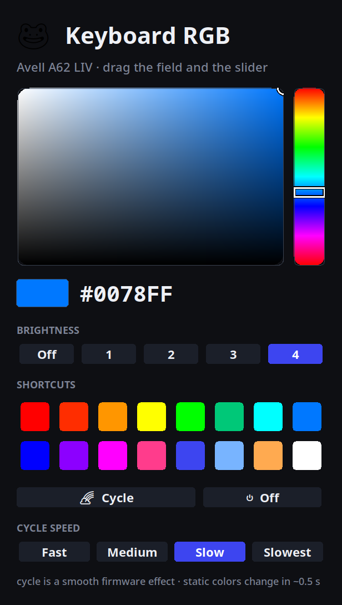

# avell-keyboard-customizer

Customize the **RGB keyboard backlight** of Avell laptops (Uniwill / Tongfang
barebones) on Linux — with a clean Tk desktop app **and** a `kbcolor` CLI.

> Built and tested on an **Avell A62 LIV** (Intel i7-10750H, Uniwill single-zone
> RGB) running Fedora. It should work on other Uniwill-based laptops exposing the
> same EC interface — see [Hardware support](#hardware-support).


<p align="center"></p>

---

## Features

- 🎨 **Real color picker** — saturation/value field + vertical hue slider, drag to
  pick any RGB, applied live.
- ⚡ **Instant UI** — the embedded controller is slow (~0.5 s per write); the UI
  never waits on it (see [How it works](#how-it-works)).
- 🌈 **Smooth rainbow** — runs as a *firmware* effect with an adjustable speed,
  via a small kernel-driver patch (no choppy software animation).
- 🔆 Brightness levels, one-click color shortcuts, and an off switch.
- ⌨️ **`kbcolor` CLI** — `kbcolor blue`, `kbcolor "#ff8800"`, `kbcolor rainbow --speed slow`.
- 🔓 No `sudo` at runtime — a udev rule grants your user write access to the LED.

## How it works

This project is mostly an exercise in working *around* slow, undocumented
hardware. Two findings shaped the design:

1. **The EC is slow.** Each color write to `/sys/class/leds/rgb:kbd_backlight`
   blocks for ~**480 ms** (measured). Naively writing on every pointer move makes
   the keyboard lag seconds behind. The app therefore runs a **background worker
   that always applies the *latest* requested state and drops the intermediate
   ones** (latest-wins coalescing), plus a pure planner that emits only the writes
   that actually changed.

2. **The firmware can do the rainbow itself.** The EC exposes a hardware
   color-cycle (bit `0x80` of register `0x0767`) and a speed byte at `0x0768`
   — the upstream `tuxedo-drivers` defines the bit but never surfaces it. A small
   [kernel patch](kernel/) exposes both as named sysfs attributes
   (`kbd_rainbow`, `kbd_rainbow_speed`), so the smooth cycle is done in firmware
   instead of fighting the 0.5 s write latency from userspace.

Full write-up: [`docs/ARCHITECTURE.md`](docs/ARCHITECTURE.md).

## Architecture

A small layered design with dependencies pointing inward (clean architecture):

```
color / state          domain value objects — pure, no I/O          (innermost)
   ▲
backend                KeyboardBackend (port) + SysfsKeyboardBackend (adapter)
   ▲
controller             application service: async worker + pure write planner
   ▲
widgets / app / cli    presentation & entry points                  (outermost)
```

The GUI and CLI depend on the `KeyboardBackend` **abstraction**, never on sysfs
directly, so the hardware can be faked in tests or swapped without touching the
UI (Dependency Inversion). The write-minimization logic is a pure function
(`plan_transition`) unit-tested with no threads and no hardware.

## Compatibility

**Tested configuration**

| | |
|---|---|
| Laptop | **Avell A62 LIV** — Uniwill/Tongfang barebone (`UNIW0001` ACPI device) |
| CPU | Intel Core i7-10750H (Comet Lake) |
| Backlight | **Single-zone RGB** — the whole keyboard is one color at a time |
| OS / kernel | Fedora, kernel 7.x (any modern distro should work) |
| Python | 3.10+ with Tkinter |
| Driver | patched [`tuxedo-drivers`](kernel/) exposing `/sys/class/leds/rgb:kbd_backlight` |

**Will it work on my laptop?** Run these checks:

```bash
# 1. Uniwill barebone? (this tool targets these)
ls /sys/bus/acpi/devices/ | grep -i UNIW            # expect e.g. UNIW0001

# 2. Single-zone RGB exposed by the driver?
ls /sys/class/leds/ | grep kbd_backlight            # expect: rgb:kbd_backlight

# 3. NOT a per-key (ITE) keyboard?
lsusb | grep -i 048d                                # expect: no output
```

If #1/#2 match and #3 is empty, you are almost certainly compatible. Other Avell
/ Uniwill / TUXEDO / some Schenker & Eluktronics models share this chassis and
EC, so they may work too.

**Not supported**

- ❌ **Per-key / per-zone RGB** — this hardware addresses the whole keyboard as
  one zone. Laptops with per-key RGB expose an ITE 8291 USB controller
  (`lsusb` shows `048d:…`); use [OpenRGB](https://openrgb.org/) or
  `ite8291r3-ctl` for those instead.
- ❌ **Clevo-based laptops** — different EC path (their Clevo WMI interface is a
  stub on this Uniwill board and is deliberately blocked).
- ❌ **White-only / non-RGB backlights** — nothing to color.

## Requirements

- Linux with the **patched `tuxedo-drivers`** module loaded (see [`kernel/`](kernel/)).
- Python **3.10+** with Tkinter (`python3-tkinter` on Fedora, `python3-tk` on Debian/Ubuntu).
- A graphical session for the GUI (the CLI works headless).

## Install

```bash
# Build & install the patched module + udev rule + commands + desktop launcher
sudo ./scripts/install.sh           # direct build (re-run after a kernel upgrade)
sudo ./scripts/install.sh --dkms    # DKMS: rebuilds automatically on kernel upgrades
```

`scripts/install.sh` builds the patched module, installs the udev rule (sudo-less
access), the `modules-load`/blacklist configs, the `kbcolor` + `kbcolor-gui`
commands, and a desktop launcher. With `--dkms` the module is registered with DKMS
so it survives kernel upgrades. To remove everything: `sudo ./scripts/uninstall.sh`.

Prefer pip for just the userspace tools (driver still required):

```bash
pipx install .        # or: pip install --user .
```

## Usage

GUI:

```bash
kbcolor-gui            # or launch "Keyboard RGB" from your app menu
```

CLI:

```bash
kbcolor blue                 # a named color at full brightness
kbcolor "#ff8800"            # hex
kbcolor 255 128 0            # explicit RGB
kbcolor blue --brightness 2
kbcolor rainbow --speed slow # firmware rainbow (fast | medium | slow | slowest | 0-255)
kbcolor rainbow --off
kbcolor off
kbcolor status
```

## Development

```bash
pip install -e ".[dev]"
pytest          # pure logic: color math + write planner + controller
ruff check .
```

```
src/avell_rgb/
  color.py        domain: immutable Color + HSV/RGB
  state.py        domain: BacklightState value object
  backend.py      port (KeyboardBackend) + sysfs adapter
  controller.py   async worker + pure plan_transition()
  widgets.py      reusable Tk canvas widgets
  app.py          GUI composition root
  cli.py          kbcolor command
kernel/           driver patch + build notes
packaging/        udev rule, desktop entry, modprobe/modules-load configs
tests/            pytest suite (no hardware required)
```

## Credits & license

- Userspace code (app + CLI): **MIT** — see [`LICENSE`](LICENSE).
- The kernel patch derives from
  [tuxedo-drivers](https://gitlab.com/tuxedocomputers/development/packages/tuxedo-drivers)
  by TUXEDO Computers and is therefore **GPL-2.0-or-later**. Huge thanks to that
  project for the Uniwill EC groundwork.

This is an independent, unofficial project and is not affiliated with Avell or
TUXEDO Computers.
